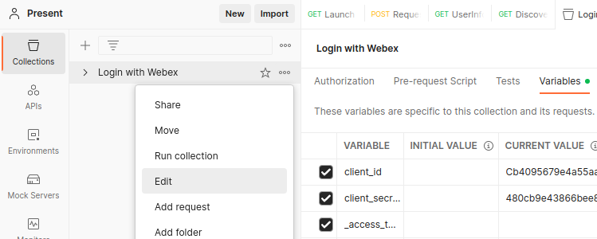
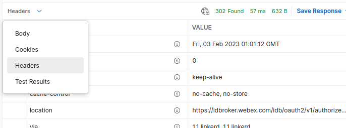
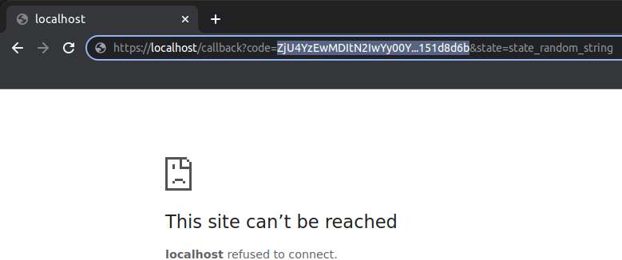
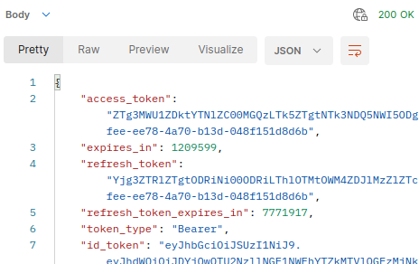
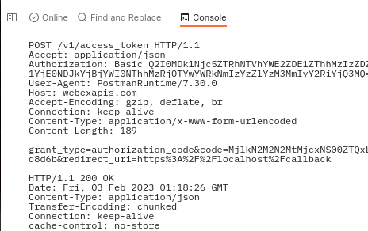

# webex-login-with-webex-sample

Sample demonstrating how to protect a resource, with a simple Node.js/Express web app using Login with Webex via OpenId Connect.

[Login with Webex](https://developer.webex.com/docs/login-with-webex)

## Requirements

* An HTTP reverse proxy configured to forward HTTPS to this applications' web server on port 8080 (default.)

  [Caddy](https://caddyserver.com/) provides a simple reverse proxy suitable for development.  `caddy.sh` is included, for use if it's installed.

* Node.js (tested with v18.16.1)

* (Optional) The project was developed using [Visual Studio Code](https://code.visualstudio.com/) (a `launch.json` is included).

## Getting Started

* Clone this repo:

  ```bash
  git clone https://github.com/CiscoDevNet/webex-login-with-webex-sample.git
  cd webex-login-with-webex-sample.git
  ```

* Install dependencies:

  ```bash
  npm install
  ```

* (Optional) A patch to add additional debug output when OAuth/JWT authentication errors occur has also been provided in `patches/passport_strategy.js.patch`.

  To install the patch:

  ```bash
  ./apply_patches.sh
  ```

* Create a [Webex Integration](https://developer.webex.com/docs/integrations):

    * The Redirect URI should point to the URL of the HTTPS reverse proxy, with `/callback` appended.
    
      E.g. if running on your local PC via Caddy:

      ```
      https://localhost/callback
      ```

    * The only scope needed is: `spark:people_read`

* Rename `.env.example` to `.env` and configure:

  * Webex integration credentials (Client ID and Client Secret)

  * Webex integration redirect URL

  * Webex user email/Id of the user to be granted access to the web app

  * Web server listening port (default is 8080)

* Start your reverse proxy, e.g. forwarding port 443 -> 8080.

  If you have Caddy installed, run:

  ```bash
  ./caddh.sh
  ```

* Launch the application.

  **Via terminal**

  ```bash
  node app.js
  ```

  **Via VS Code**

  * Select the **Run and Debug** tab

  * Click the green **Start Debugging** button, or press `**F5**`

* Open a browser (incognito mode recommended to ensure no previous Webex login cookies are present) and navigate to the reverse proxy URL.

  E.g. if running on your local PC via Caddy:

  ```
  https://localhost
  ```

## Using the Postman Collection

To allow direct HTTP-level experimentation with the Login for Webex Authorization Code flow, a collection for use with the popular [Postman](https://www.postman.com/downloads/?utm_source=postman-home) REST API test tool is provided: `Login with Webex.postman_collection.json`

As the OAuth2 Authorization Code flow requires the user to interact with the IdP to enter credentials as part of the sequence, completing the flow with Postman involves copying some values back and forth between Postman and an (incognito) browser during the sequence:

1. Import the Postman collection (see [instructions](https://learning.postman.com/docs/getting-started/importing-and-exporting-data/)).

1. Select the Postman **Collections** tab, then click the "**...**" (three dots) menu next to the collection name, and select **Edit**:

   

1. Enter the `client_id` and `client_secret` for your Webex Integration into the **Current Value** fields.

## Launching the Authorization Code Flow

To launch the OAuth2 flow, we will use the collection's **Launch Authorization Code Flow** request to generate the initial URL, then copy the resulting redirect URI from Webex and complete the login in a browser:

1. Expand the **Login with Webex** collection, and select **Launch Authorization Code Flow**.

1. Click **Send** to launch the request (make sure you have entered the Integration `client_id`/`client_secret` into the collection variables window - see above).

   The result should be a `HTTP 302 Found` response (with an empty body).

1. In the Postman response area, click on the response view selector dropdown (default is **Body**), and select **Headers**.

   Copy the **Location** header value to the clipboard:

   

1. Open a new **incognito**/**private** browser, and paste/navigate to the Location URL.

   Complete the prompts to authenticate with Webex.

1. As the last step in the login sequence, the browser will be redirected back to the `redirect_uri` specified in the launch request.  As this URL (intentionally) does not exist, the browser will display an error.

   However, the authorization `code` we need can be seen in the browser URL bar as a query parameter:

   

   Go ahead and copy the `code` value to the clipboard.
   
    **Be sure not to include the `&state=state_random_string` portion at the end of the URL**!

1. In the Postman collection tree, click to open the **Reqeust Access Token** request.

1. Select the **Body** tab and paste in the `code` value.

1. Click **Send** to make the request.

   You should see a `HTTP 200 OK` response, with JSON data in the body including the `access_token`:

   

The post-request test script for this request (see the **Tests** tab) automatically extracts the `access_token` into a temporary Postman variable: `_access_token`.

This will be available to other requests (e.g. **UserInfo**) automatically, so you can try them without copying/pasting the access token.

**Tip**

You can use the [Postman console](https://blog.postman.com/the-postman-console/) to view the actual/raw HTTP request/response contents - often helpful during troubleshooting:




